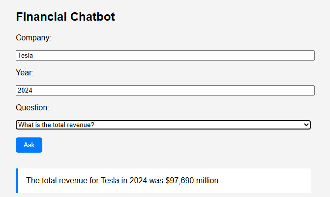
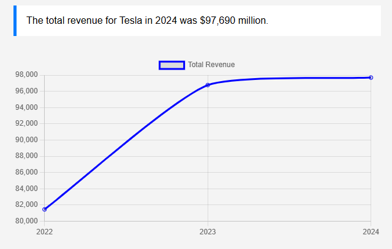
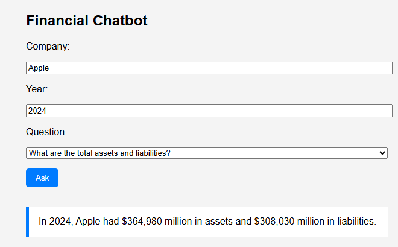
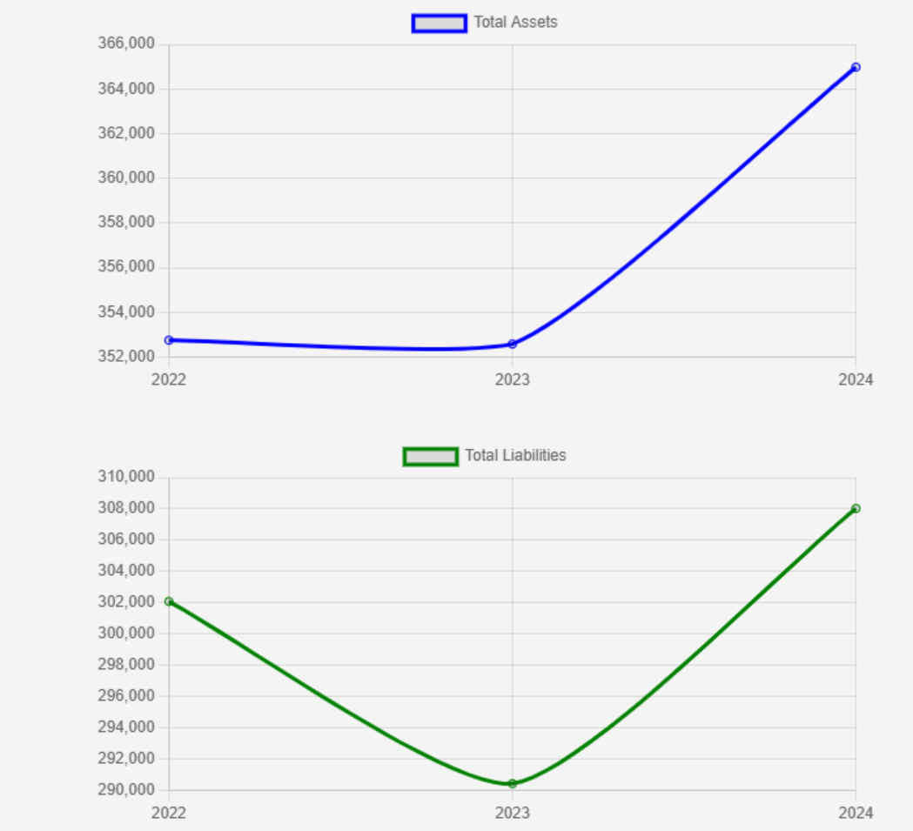

#  Financial Analysis & Chatbot – Microsoft, Apple, Tesla (2022–2024)

This project involves **manual extraction** of key financial data from SEC filings (10-K reports), trend analysis using Python (Pandas), and the development of a **simple financial chatbot** powered by FastAPI. The goal is to explore how AI can be applied in financial analytics and client support.

---

##  Project Overview

###  Objective
- Extract financial metrics (Total Revenue, Net Income, Total Assets, Total Liabilities, Operating Cash Flow) for **Apple**, **Tesla**, and **Microsoft** over the past three fiscal years.
- Analyze year-over-year trends in these financial figures using **Python and Pandas**.
- Build a minimal chatbot that answers key financial queries using **FastAPI**.

---

##  Step 1: Manual Data Extraction

- **Source**: [SEC EDGAR Database](https://www.sec.gov/edgar/searchedgar/companysearch.html)
- **Companies**: Microsoft, Tesla, Apple
- **Years Covered**: 2022, 2023, 2024
- **Metrics Extracted**:
  - Total Revenue
  - Net Income
  - Total Assets
  - Total Liabilities
  - Cash Flow from Operating Activities

 The data is compiled into `BCG.xlsx`.

---

##  Step 2: Python Analysis (Jupyter Notebook)

###  Tools Used
- Python 3.9+
- Pandas, Matplotlib, Seaborn

###  Notebook: `BCGanalysis.ipynb`

##  Sample Visualizations

- **Line Chart**: Revenue and Net Income trends per company (2022–2024)
- **Percentage Growth**: Year-over-Year Net Income Growth per company

---

## Insights Summary (from Analysis)

##  Net Income Growth

Unlike revenue, **Apple's** net income **increased by 2.8% in 2023** and by **3.47% in 2024**.  
However, this was **not the case for Microsoft** — although there was a modest **0.52% rise in 2023** compared to 2022, it was followed by a **sharp 15% drop in 2024**.  
Tesla experienced the **opposite trend**: a **15% decline in 2023**, but a major comeback with a **109.3% increase in 2024**, resulting in strong overall net income growth.

---

##  Revenue Growth

- **Apple** saw a **2.88% revenue increase in 2023** but experienced a **1.98% decline in 2024**.
- **Microsoft**'s revenue **dropped by 6.43% in 2023** compared to 2022, followed by an even **steeper 13.5% decline in 2024** — showing a **continuing downward trend**.
- **Tesla**'s revenue **fell by 15.8% in 2023**, but it **recovered slightly with just a 0.9% decline in 2024**.

>  **Insight**: Despite different patterns, all three companies demonstrated **a downward trend in revenue** growth in recent years.

---

## Step 3: Financial Chatbot (FastAPI)
##  Chatbot Preview

The following images show how the financial chatbot works when queried about specific financial data points for Apple, and Tesla.










A minimal chatbot built using **FastAPI** that responds to predefined financial queries related to Apple, Tesla, and Microsoft based on 10-K filings.

### Supported Questions

1. **"What is the total revenue for Microsoft in 2024?"**
2. **"What is the income growth of Tesla over 3 years?"**
3. **"How much cash flow did Apple have in 2023?"**
4. **"Compare assets and liabilities of Microsoft in 2022"**


> These questions can be selected in the options.
> The chatbot returns the requested financial metric by retrieving the data from the pre-processed dataset.

##  How to Run the Chatbot

```bash
cd chatbot
uvicorn main:app --reload
```
## Clone the repository 
```
git clone https://github.com/your-username/financial-chatbot-analysis.git
cd financial-chatbot-analysis
```

## Conclusion
This project demonstrates a full pipeline for:

 **Manual data collection from real-world financial filings**
 **Programmatic financial trend analysis with Jupyter Notebook**
 **financial Q&A experience using FastAPI**
